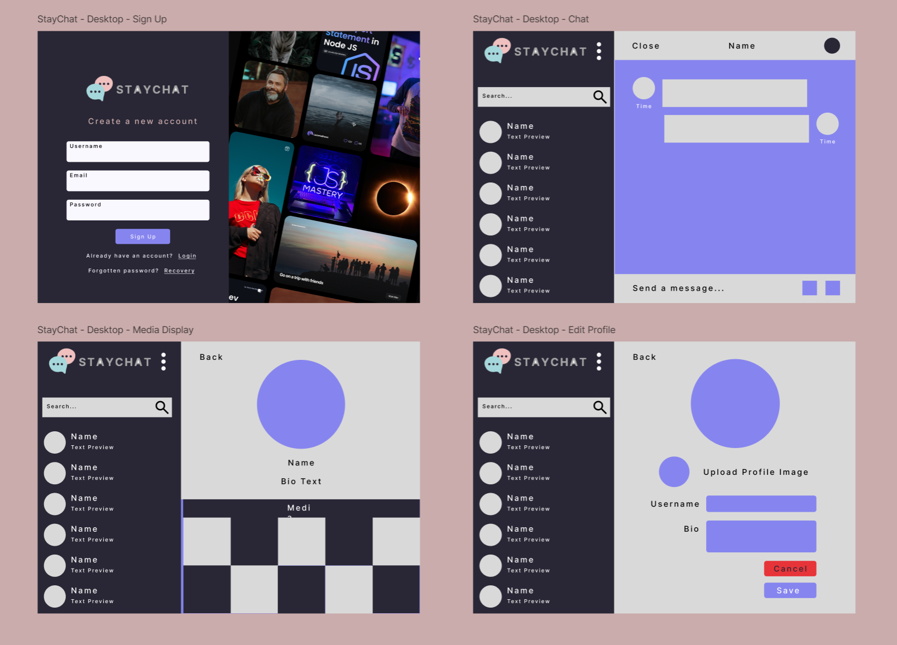

# Real-Time Chat Application 💬

This project is about connecting and communicating in real-time with this feature-rich chat application. Users can instantly message friends, share images, and easily find new connections with a built-in friend search. The app includes secure user account management (sign-in/login), allows for profile customization, and features a fully responsive layout.

---

## Table of Contents 📝

- [Features](#features)
- [Folder Structure](#folder-structure)
- [Technologies Used](#technologies-used)
- [Getting Started](#getting-started)
  - [Prerequisites](#prerequisites)
  - [Firebase Setup](#firebase-setup)
  - [Installation](#installation)
- [Contributing](#contributing)

---

## Features ✨

- **Real-Time Messaging:** Instantaneous message delivery between users.
- **User Authentication:** Secure sign-up, login, and session management via Firebase.
- **Friend Search:** Ability for users to search for and connect with other users.
- **Image Sharing:** Users can send and receive images within chats.
- **Profile Editing:** Users can customize their profiles (e.g., display name, avatar).
- **Responsive Design:** Seamless user experience across desktops, tablets, and mobile devices.
- **Notifications:** User-friendly notifications using `react-toastify`.

---

## Folder Structure 📁

The project follows a standard Vite + React structure:

```plaintext
├── src/
│   ├── assets/           # Static assets (images, icons, etc.)
│   ├── components/       # Reusable UI components
│   │   ├── component/    # General or shared sub-components
│   │   ├── context/      # React Context API for state management
│   │   ├── navbar/       # Navigation bar component(s)
│   │   └── overlap/      # UI elements that overlap content (e.g., modals, popups)
│   ├── config/           # Configuration files
│   │   └── firebase.js   # Firebase configuration and initialization
│   ├── pages/            # Page-level components
│   │   ├── _auth/        # Authentication-related pages (Login, Register)
│   │   └── _root/        # Root layout or structure for authenticated pages
│   ├── App.jsx           # Main application component (handles routing)
│   ├── index.css         # Global styles and Tailwind CSS directives
│   └── main.jsx          # Application entry point for React
├── .gitignore            # Specifies intentionally untracked files for Git
├── eslint.config.js      # ESLint configuration for code linting
├── index.html            # Main HTML template for the SPA
├── package-lock.json     # Exact versions of dependencies
├── package.json          # Project metadata and dependencies
├── README.md             # This file
├── tailwind.config.js    # Tailwind CSS configuration
└── vite.config.js        # Vite configuration file
```

---

## Technologies Used 🛠️

* **Front-End:**

  - Library/Framework: React
  - Build Tool: Vite
  - Routing: React Router DOM
  - CSS Framework: Tailwind CSS
  - Notifications: React Toastify

* **Back-End:**
  - Firebase:
    - Firebase Authentication (For user sign-in/login)
    - Firestore Database (For storing messages, user data)
  - Cloudinary:
    - Cloudinary Storage (For image uploads to the website and save it in Firebase (with url))

---

## Getting Started 🚀

Follow these instructions to get a local copy up and running for development and testing.

### Prerequisites

You'll need [Node.js](https://nodejs.org/en/) and [npm](https://www.npmjs.com/) installed on your machine.

### Installation

1.  **Clone the repository:**
    ```bash
    git clone https://github.com/VannetNang/stay-chat-app.git
    cd stay-chat-app
    ```

2.  **Install dependencies:**
    ```bash
    npm install
    ```

3.  **Install frameworks / libraries:**
    ```bash
    npm install firebase cloudinary toastify react-router-dom tailwindcss @tailwindcss/vite
    ```

* In case, tailwindcss installation does not work: Go to this [TailwindCSS Installation](https://tailwindcss.com/docs/installation/using-vite)

4.  **Set up environment variables:**
    Create a `.env` file in the `Front-end` root directory. See the example section below for the required variables.

5.  **Start the development server:**
    This command starts the Vite development server.
    ```bash
    npm run dev
    ```
    The application will be accessible at `http://localhost:5173`

---

## Environment Variables (.env.example)

Create a `.env` file in the root directory and add the following variables. Replace the placeholder values with your actual credentials.

**Note:** Vite requires environment variables exposed to the browser to be prefixed with `VITE_`.

````env
# Firebase Credentials
VITE_FIREBASE_API_KEY=your_api_key
VITE_FIREBASE_AUTH_DOMAIN=your_auth_domain
VITE_FIREBASE_PROJECT_ID=your_project_id
VITE_FIREBASE_STORAGE_BUCKET=your_storage_bucket
VITE_FIREBASE_MESSAGING_SENDER_ID=your_messaging_sender_id
VITE_FIREBASE_APP_ID=your_app_id

# Cloudinary Configuration
VITE_CLOUDINARY_UPLOAD_PRESET=your_cloudinary_storage
VITE_CLOUDINARY_CLOUD_NAME=your_cloudinary_name
VITE_CLOUDINARY_URL_API_BASE=your_cloudinary_api
```

---

## Contributing

We welcome contributions that add features or address anything currently lacking in the project! If you'd like to contribute, please follow these steps:

1.  **Fork the Project:**
    Click the 'Fork' button at the top right of the repository page to create your own copy.

2.  **Clone that Forked Repo:**
    ```bash
    git clone <URL.git>
    ```

3.  **Create your Feature Branch:**
    ```bash
    git checkout -b <branch-name>
    ```

4.  **Commit your Changes:**
    ```bash
    git add .
    git commit -m 'Add: Implement AmazingFeature'
    ```

5.  **Push to Your Branch:**
    ```bash
    git push origin <branch-name>
    ```

6.  **Open a Pull Request:**
    Go to the original project repository and you should see a prompt to create a Pull Request from your new branch. Click it, provide a clear title and description for your changes, and submit the Pull Request.

Your Pull Request will then be reviewed, and a decision will be made on whether to accept and merge the changes. We appreciate your efforts to improve the project!
````
